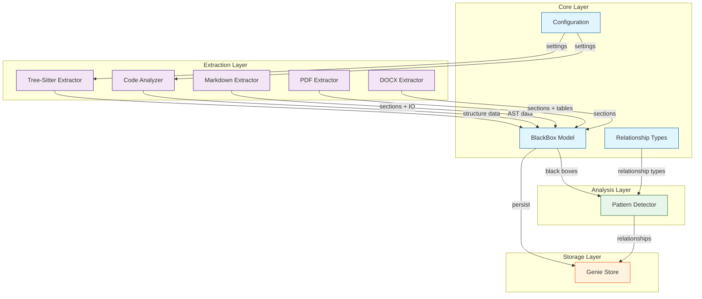

# Doc-Genie Project Analysis Report

> Generated: 2026-03-31 23:45
> Files analyzed: 11
> Modules extracted: 4
> Relationships found: 8
> Issues detected: 2

## Executive Summary

Doc-Genie is a documentation analysis toolkit that extracts "black boxes" (software components with defined inputs/outputs) from various document formats. The system uses a modular architecture with extractors for code files (Python, JavaScript, TypeScript, C) and documents (Markdown, PDF, DOCX), a relationship detection engine, and persistent storage for analysis results.

## Statistics

| Metric | Count |
|--------|-------|
| Core Modules | 4 |
| Extractors | 5 |
| Pattern Detectors | 1 |
| Storage Components | 1 |
| Data Classes | 6 |
| Supported Languages | 7 |

## Architecture Diagram



## Component Inventory

| ID | Name | Inputs | Outputs | Constraints | Status |
|----|------|--------|---------|-------------|--------|
| bb-001 | BlackBox Model | data dict | BlackBox instance | YAML serialization | Implemented |
| bb-002 | Relationship Types | source, target, type | Relationship instance | Enum validation | Implemented |
| bb-003 | GenieConfig | project_root | config dict | YAML file required | Implemented |
| bb-004 | GenieStore | project_root | persisted files | .genie directory | Implemented |
| bb-005 | Code Analyzer | filepath | functions, classes, imports | Python AST parsing | Implemented |
| bb-006 | Tree-Sitter Extractor | filepath | functions, classes, imports | Multi-language support | Implemented |
| bb-007 | Markdown Extractor | filepath | sections, IO | Markdown headings | Implemented |
| bb-008 | PDF Extractor | filepath | sections, pages | pdfplumber required | Implemented |
| bb-009 | DOCX Extractor | filepath | sections, tables | python-docx required | Implemented |
| bb-010 | Pattern Detector | BlackBox list | relationships list | Pairwise comparison | Implemented |

## Relationship Matrix

| Source | Target | Type | Confidence |
|--------|--------|------|------------|
| Code Analyzer | BlackBox Model | data_flow | 0.95 |
| Tree-Sitter Extractor | BlackBox Model | data_flow | 0.95 |
| Markdown Extractor | BlackBox Model | data_flow | 0.95 |
| PDF Extractor | BlackBox Model | data_flow | 0.90 |
| DOCX Extractor | BlackBox Model | data_flow | 0.90 |
| BlackBox Model | Pattern Detector | data_flow | 1.00 |
| Pattern Detector | GenieStore | data_flow | 1.00 |
| Configuration | Code Analyzer | dependency | 0.85 |

## Issues Found

| Severity | Type | Location | Description |
|----------|------|----------|-------------|
| Warning | missing_init | lib/extractors/ | No __init__.py file in extractors directory |
| Warning | missing_init | lib/patterns/ | No __init__.py file in patterns directory |

## Module Details

### Core Layer (lib/)

**blackbox_model.py**
- Defines data structures for the black-box abstraction model
- Classes: `BlackBoxInput`, `BlackBoxOutput`, `BlackBoxSource`, `BlackBoxAttributes`, `BlackBox`
- Supports serialization to dict/YAML format

**relationship_types.py**
- Defines relationship types between black boxes
- Enumerations: `RelationshipCategory` (7 types), `RelationshipType` (22 types)
- Categories include: DATA, CONTROL, STRUCTURE, INTERACTION, CONSTRAINT, ISSUE, MONITORING

**config.py**
- Project-level configuration management
- Supports three depth profiles: quick, medium, deep
- Configurable file types and exclusion patterns
- YAML-based configuration with deep merge support

### Extraction Layer (lib/extractors/)

**code_analyzer.py**
- AST-based code analysis for Python
- Extracts functions, classes, and imports
- Language detection for 7+ languages

**tree_sitter_extractor.py**
- Unified tree-sitter based extraction
- Supports Python, JavaScript, TypeScript, C out of the box
- Extensible for Go, Java, Rust (requires additional packages)

**markdown_extractor.py**
- Markdown section extraction using regex patterns
- Input/output detection from section content
- Hierarchical section structure with levels

**pdf_extractor.py**
- PDF content extraction using pdfplumber
- Automatic heading detection and section parsing
- Page-aware content organization

**docx_extractor.py**
- Word document extraction using python-docx
- Heading-based section structure
- Table extraction support

### Analysis Layer (lib/patterns/)

**relationship_patterns.py**
- Pattern-based relationship detection
- IO matching: detects data flow between components
- Text reference: identifies dependency mentions
- Confidence scoring for detected relationships

### Storage Layer (lib/storage/)

**genie_store.py**
- Persistent JSON storage for analysis results
- Files: boxes.json, relationships.json, patterns.json, review.json, index.json
- Search index by name, file, and keyword

## Recommendations

1. **Add __init__.py files**: Create `lib/extractors/__init__.py` and `lib/patterns/__init__.py` to make these proper Python packages with explicit exports.

2. **Add extractor base class**: Consider creating an abstract base class for extractors to enforce a consistent interface across all extraction modules.

3. **Add unit tests for extractors**: The markdown_extractor.py and tree_sitter_extractor.py lack test coverage compared to other modules.

4. **Consider async extraction**: For processing large codebases, adding async support to extractors could improve performance.

5. **Document the relationship type taxonomy**: The 22 relationship types could benefit from detailed documentation explaining when each type should be used.

## File Structure

```
lib/
|-- __init__.py
|-- blackbox_model.py       # Core data model
|-- config.py               # Configuration management
|-- relationship_types.py   # Relationship enumerations
|-- extractors/
|   |-- code_analyzer.py    # Python AST analysis
|   |-- docx_extractor.py   # Word document extraction
|   |-- markdown_extractor.py  # Markdown parsing
|   |-- pdf_extractor.py    # PDF extraction
|   |-- tree_sitter_extractor.py  # Multi-language code parsing
|-- patterns/
|   |-- relationship_patterns.py  # Relationship detection
|-- storage/
    |-- __init__.py
    |-- genie_store.py      # Persistent storage
```