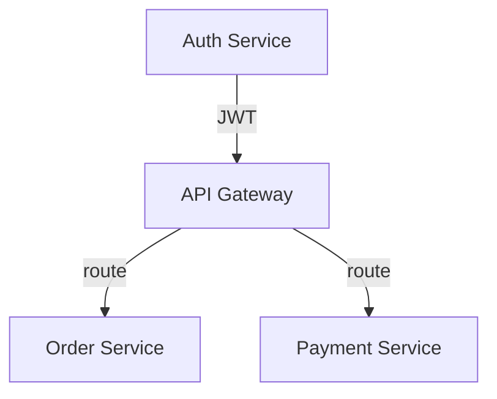
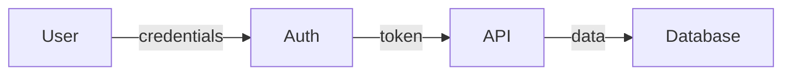
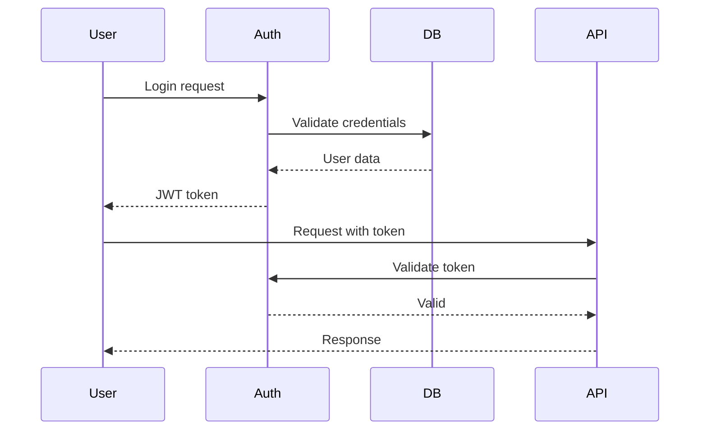
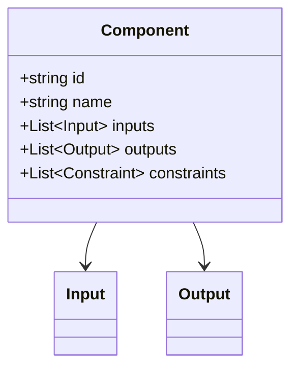

---

name: boxmatrix-report
description: >
  Generate analysis reports with Mermaid diagrams, tables, and interactive HTML dashboards.
  Use after extraction and analysis to create documentation and visualizations.
  Triggers: report, visualize, diagram, graph, dashboard, summary, html report, visualization.

---

# Generate Reports

Create structured reports from analysis results with support for Markdown and interactive HTML output.

## CLI Integration

```bash
# Generate markdown report
uv run genie report --format markdown --output analysis-report.md

# Generate HTML report (default)
uv run genie report --format html --output report.html

# Generate DOT graph
uv run genie report --format dot --output graph.dot
```

## Output Formats

| Format | Use Case | Features |
|--------|----------|----------|
| Markdown + Mermaid | Documentation, GitHub | Static diagrams, tables |
| HTML (Interactive) | Stakeholder review, exploration | vis.js graphs, filters, search |
| DOT (Graphviz) | High-quality diagrams | Export to PNG/PDF |

## Storage Integration

Reports read from `.genie/` directory:
- `boxes.json`: Extracted black boxes
- `relationships.json`: Detected relationships
- `patterns.json`: Identified patterns
- `review.json`: Review status

## Report Structure

**ALWAYS generate reports in this order:**

1. Executive Summary
2. Statistics
3. Architecture Diagram (Mermaid)
4. Black Box Inventory (Table)
5. Relationship Matrix (Table)
6. Issues Found (Table)
7. Insights (if available)

## Output Template

**ALWAYS use this exact format:**

```markdown
# System Analysis Report

> Generated: YYYY-MM-DD HH:MM
> Documents analyzed: N
> Black boxes extracted: N
> Relationships found: N
> Issues detected: N

## Executive Summary

[2-3 sentence overview of the system]

## Statistics

| Metric | Count |
|--------|-------|
| Documents | N |
| Black Boxes | N |
| Relationships | N |
| Data Flow | N |
| Dependencies | N |
| Issues | N |

## Architecture Diagram

\`\`\`mermaid
graph TD
    A[Component A] -->|data| B[Component B]
    B -->|calls| C[Component C]
    C -.->|optional| D[Component D]
    
    subgraph "Module 1"
        A
        B
    end
    
    subgraph "Module 2"
        C
        D
    end
\`\`\`

## Black Box Inventory

| ID | Name | Inputs | Outputs | Constraints | Status |
|----|------|--------|---------|-------------|--------|
| bb-001 | Component A | input1, input2 | output1 | constraint1 | ✅ |
| bb-002 | Component B | output1 | output2 | constraint2 | ✅ |

## Relationship Matrix

| Source | → | Target | Type | Confidence |
|--------|---|--------|------|------------|
| bb-001 | → | bb-002 | data_flow | 0.95 |
| bb-002 | → | bb-003 | dependency | 0.90 |

## Issues Found

| Severity | Type | Location | Description |
|----------|------|----------|-------------|
| ❌ Error | interface_mismatch | bb-001 → bb-002 | Output format differs from expected input |
| ⚠️ Warning | missing_dependency | bb-003 | Depends on undefined component |
| ℹ️ Info | orphan_node | bb-004 | No inputs or outputs detected |

## Insights

[Include output from boxmatrix-insights if available]

### Implicit Relationships
[Table from boxmatrix-insights]

### Conflicts
[Table from boxmatrix-insights]

### Patterns
[Design patterns, anti-patterns, missing components]

## Recommendations

1. [Recommendation 1]
2. [Recommendation 2]
3. [Recommendation 3]
```

## Mermaid Diagram Types

### Component Diagram


### Data Flow Diagram


### Sequence Diagram


### Class Diagram


---

## HTML Report Template

**For HTML output, read the template at:** `references/html-template.html`

### Template Placeholders

Replace these placeholders with actual data:

| Placeholder | Description | Example |
|-------------|-------------|---------|
| `{{PROJECT_NAME}}` | Project name | "BoxMatrix" |
| `{{TIMESTAMP}}` | Generation time | "2026-03-31 15:30:00" |
| `{{BOX_COUNT}}` | Total black boxes | 12 |
| `{{REL_COUNT}}` | Total relationships | 18 |
| `{{ISSUE_COUNT}}` | Issues found | 3 |
| `{{AVG_CONFIDENCE}}` | Average confidence | "0.82" |
| `{{VIS_NODES}}` | vis.js nodes array | `[{id:1,label:"A",group:"core"}]` |
| `{{VIS_EDGES}}` | vis.js edges array | `[{from:1,to:2,label:"data_flow"}]` |
| `{{BOX_ROWS}}` | Box inventory rows | `<tr><td>bb-001</td>...</tr>` |
| `{{REL_ROWS}}` | Relationship rows | `<tr><td>Component A</td>...</tr>` |
| `{{ISSUE_ROWS}}` | Issue rows | `<tr><td><span class="badge-error">Error</span></td>...</tr>` |
| `{{INSIGHTS}}` | Insight cards | `<div class="insight-card">...</div>` |
| `{{RECOMMENDATIONS}}` | Recommendation items | `<li>Recommendation 1</li>` |

### Required Features

1. **Interactive Network Graph** (vis.js)
   - Click nodes to see details
   - Color-coded by type/group
   - Arrow direction shows data flow

2. **Charts** (Chart.js)
   - Doughnut: Boxes by type
   - Bar: Relationship distribution

3. **Searchable Tables**
   - Filter by text input
   - Sortable columns

4. **Dark Theme**
   - Gradient background
   - Card-based layout
   - Color-coded badges

### Output Location

Save generated HTML to: `.genie/reports/report-YYYYMMDD-HHMM.html`
