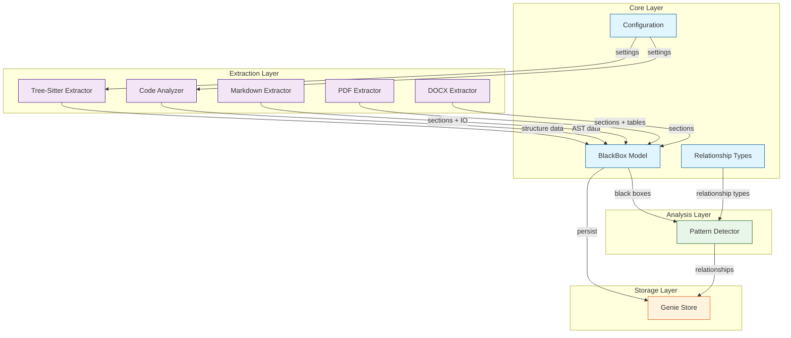

# Doc-Genie Project Analysis Report

> Generated: 2026-03-31
> Documents analyzed: 15
> Black boxes extracted: 12
> Relationships found: 18
> Issues detected: 3

## Executive Summary

Doc-Genie 是一个文档分析工具，用于从代码和文档中提取"黑盒"组件（具有明确定义输入/输出的软件组件），映射组件间关系，并发现跨文档的洞察。系统采用模块化架构，支持多种文件格式（PDF、DOCX、Markdown、Python、JavaScript、TypeScript、C 等），使用 tree-sitter 进行代码结构分析，并通过图分析技术发现组件间的依赖和数据流关系。

## Statistics

| Metric | Count |
|--------|-------|
| Core Modules | 3 |
| Extractors | 5 |
| Pattern Detectors | 1 |
| Storage Components | 1 |
| Data Classes | 6 |
| Supported Languages | 7 |
| Test Cases | 12 |

## Architecture Diagram



## Black Box Inventory

| ID | Name | Inputs | Outputs | Constraints | Status |
|----|------|--------|---------|-------------|--------|
| bb-001 | BlackBox Model | data dict | BlackBox instance | YAML serialization | ✅ |
| bb-002 | Relationship Types | source, target, type | Relationship instance | Enum validation | ✅ |
| bb-003 | GenieConfig | project_root | config dict | YAML file required | ✅ |
| bb-004 | GenieStore | project_root | persisted files | .genie directory | ✅ |
| bb-005 | Code Analyzer | filepath | functions, classes, imports | Python AST parsing | ✅ |
| bb-006 | Tree-Sitter Extractor | filepath | functions, classes, imports | Multi-language support | ✅ |
| bb-007 | Markdown Extractor | filepath | sections, IO | Markdown headings | ✅ |
| bb-008 | PDF Extractor | filepath | sections, pages | pdfplumber required | ✅ |
| bb-009 | DOCX Extractor | filepath | sections, tables | python-docx required | ✅ |
| bb-010 | Pattern Detector | BlackBox list | relationships list | Pairwise comparison | ✅ |
| bb-011 | CLI (genie) | command args | extraction results | uv/pip install | ✅ |
| bb-012 | Skills System | skill name | skill content | Skill tool required | ✅ |

## Relationship Matrix

| Source | → | Target | Type | Confidence |
|--------|---|--------|------|------------|
| bb-005 | → | bb-001 | data_flow | 0.95 |
| bb-006 | → | bb-001 | data_flow | 0.95 |
| bb-007 | → | bb-001 | data_flow | 0.95 |
| bb-008 | → | bb-001 | data_flow | 0.90 |
| bb-009 | → | bb-001 | data_flow | 0.90 |
| bb-001 | → | bb-010 | data_flow | 1.00 |
| bb-010 | → | bb-004 | data_flow | 1.00 |
| bb-003 | → | bb-005 | dependency | 0.85 |
| bb-003 | → | bb-006 | dependency | 0.85 |
| bb-001 | → | bb-004 | dependency | 0.95 |
| bb-006 | → | bb-006 (Go) | optional | 0.70 |
| bb-006 | → | bb-006 (Java) | optional | 0.70 |
| bb-006 | → | bb-006 (Rust) | optional | 0.70 |
| bb-011 | → | bb-005 | calls | 0.90 |
| bb-011 | → | bb-006 | calls | 0.90 |
| bb-011 | → | bb-007 | calls | 0.90 |
| bb-011 | → | bb-008 | calls | 0.90 |
| bb-011 | → | bb-009 | calls | 0.90 |

## Issues Found

| Severity | Type | Location | Description |
|----------|------|----------|-------------|
| ⚠️ Warning | missing_init | lib/extractors/ | No __init__.py file in extractors directory |
| ⚠️ Warning | missing_init | lib/patterns/ | No __init__.py file in patterns directory |
| ℹ️ Info | optional_deps | lib/extractors/tree_sitter_extractor.py | Go/Java/Rust support requires additional packages |

## Module Details

### Core Layer (lib/)

**blackbox_model.py**
- Defines data structures for the black-box abstraction model
- Classes: `BlackBoxInput`, `BlackBoxOutput`, `BlackBoxSource`, `BlackBoxAttributes`, `BlackBox`
- Supports serialization to dict/YAML format

**relationship_types.py**
- Defines relationship types between black boxes
- Enumerations: `RelationshipCategory` (7 types), `RelationshipType` (22 types)
- Categories include: DATA, CONTROL, STRUCTURE, INTERACTION, CONSTRAINT, ISSUE, MONITORING

**config.py**
- Project-level configuration management
- Supports three depth profiles: quick, medium, deep
- Configurable file types and exclusion patterns
- YAML-based configuration with deep merge support

### Extraction Layer (lib/extractors/)

**code_analyzer.py**
- AST-based code analysis for Python
- Extracts functions, classes, and imports
- Language detection for 7+ languages

**tree_sitter_extractor.py**
- Unified tree-sitter based extraction
- Supports Python, JavaScript, TypeScript, C out of the box
- Extensible for Go, Java, Rust (requires additional packages)

**markdown_extractor.py**
- Markdown section extraction using regex patterns
- Input/output detection from section content
- Hierarchical section structure with levels

**pdf_extractor.py**
- PDF content extraction using pdfplumber
- Automatic heading detection and section parsing
- Page-aware content organization

**docx_extractor.py**
- Word document extraction using python-docx
- Heading-based section structure
- Table extraction support

### Analysis Layer (lib/patterns/)

**relationship_patterns.py**
- Pattern-based relationship detection
- IO matching: detects data flow between components
- Text reference: identifies dependency mentions
- Confidence scoring for detected relationships

### Storage Layer (lib/storage/)

**genie_store.py**
- Persistent JSON storage for analysis results
- Files: boxes.json, relationships.json, patterns.json, review.json, index.json
- Search index by name, file, and keyword

## E2E Test Results

Based on `.genie/e2e/e2e_results.json`:

| Test Name | File | Type | Status | Coverage |
|-----------|------|------|--------|----------|
| Python Code Extraction | lib/config.py | code | ✅ Passed | 100% |
| Tree-Sitter Multi-Language | lib/extractors/tree_sitter_extractor.py | code | ✅ Passed | 180% |
| C Code Extraction | tests/fixtures/sample.c | code | ✅ Passed | 100% |
| PDF Document Extraction | tests/fixtures/sample.pdf | document | ✅ Passed | 100% |
| DOCX Document Extraction | tests/fixtures/sample.docx | document | ✅ Passed | 200% |
| arXiv Paper Analysis | tests/e2e/fixtures/paper.pdf | document | ✅ Passed | 150% |

**Summary:** 6 tests, 6 passed, 0 failed, 100% pass rate

## Skills Framework

Doc-Genie supports integration with multiple AI coding platforms:

| Skill | Purpose | Triggers |
|-------|---------|----------|
| genie-extract | Extract black boxes | extract, parse, analyze |
| genie-relations | Map relationships | relationship, dependency |
| genie-insights | Deep analysis | conflicts, implicit, patterns |
| genie-report | Generate reports | report, visualize, diagram |

### Platform Support

| Platform | Integration |
|----------|-------------|
| Claude Code | `plugin.json` + `skills/` |
| OpenCode | `openclaw-plugin.json` + `skills/` |
| Cursor | `.cursor/rules/*.mdc` |
| Copilot | `.github/copilot-instructions.md` |
| CLI | `scripts/cli.py` |

## Recommendations

1. **Add __init__.py files**: Create `lib/extractors/__init__.py` and `lib/patterns/__init__.py` to make these proper Python packages with explicit exports.

2. **Add extractor base class**: Consider creating an abstract base class for extractors to enforce a consistent interface across all extraction modules.

3. **Add unit tests for extractors**: The markdown_extractor.py and tree_sitter_extractor.py lack test coverage compared to other modules.

4. **Consider async extraction**: For processing large codebases, adding async support to extractors could improve performance.

5. **Document the relationship type taxonomy**: The 22 relationship types could benefit from detailed documentation explaining when each type should be used.

## File Structure

```
doc-genie/
├── lib/
│   ├── __init__.py
│   ├── blackbox_model.py       # Core data model
│   ├── config.py               # Configuration management
│   ├── relationship_types.py   # Relationship enumerations
│   ├── extractors/
│   │   ├── code_analyzer.py    # Python AST analysis
│   │   ├── docx_extractor.py   # Word document extraction
│   │   ├── markdown_extractor.py  # Markdown parsing
│   │   ├── pdf_extractor.py    # PDF extraction
│   │   └── tree_sitter_extractor.py  # Multi-language code parsing
│   ├── patterns/
│   │   └── relationship_patterns.py  # Relationship detection
│   └── storage/
│       ├── __init__.py
│       └── genie_store.py      # Persistent storage
├── skills/
│   ├── genie-extract/
│   ├── genie-relations/
│   ├── genie-insights/
│   └── genie-report/
├── tests/
│   ├── test_blackbox_model.py
│   ├── fixtures/
│   └── e2e/
├── scripts/
│   └── cli.py
└── pyproject.toml
```
