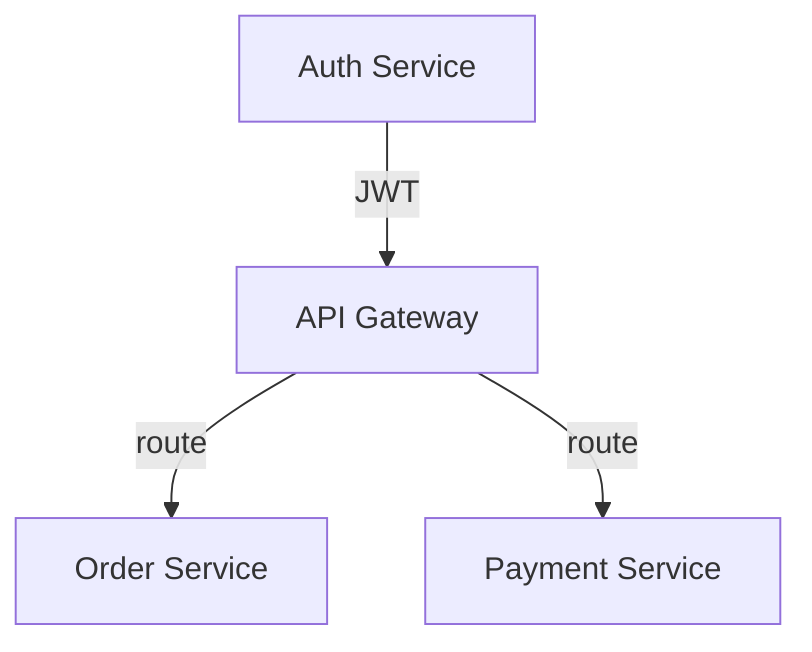
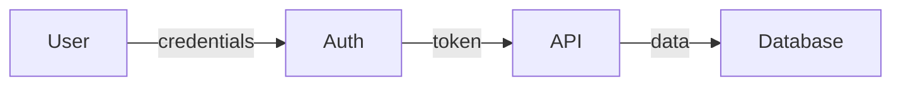
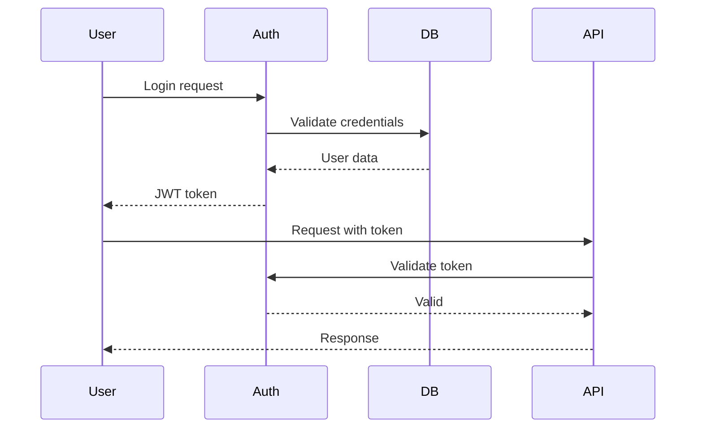
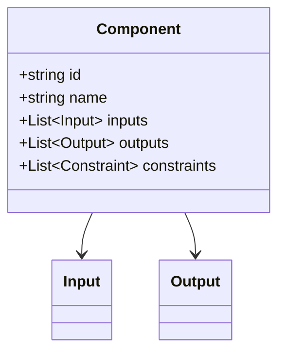

# Generate Reports

Create structured reports from analysis results.

## CLI Integration

```bash
# Generate markdown report
uv run genie report --format markdown --output analysis-report.md

# Generate HTML report
uv run genie report --format html --output report.html

# Generate DOT graph
uv run genie report --format dot --output graph.dot
```

## Output Formats

| Format | Use Case | Tool |
|--------|----------|------|
| Markdown + Mermaid | Documentation, GitHub | Direct generation |
| Table | Quick summary | Direct generation |
| HTML (vis.js CDN) | Interactive exploration | Template-based |
| DOT (Graphviz) | High-quality diagrams | networkx export |

## Storage Integration

Reports read from `.genie/` directory:
- `boxes.json`: Extracted black boxes
- `relationships.json`: Detected relationships
- `patterns.json`: Identified patterns
- `review.json`: Review status

## Report Structure

**ALWAYS generate reports in this order:**

1. Executive Summary
2. Statistics
3. Architecture Diagram (Mermaid)
4. Black Box Inventory (Table)
5. Relationship Matrix (Table)
6. Issues Found (Table)
7. Insights (if available)

## Output Template

**ALWAYS use this exact format:**

```markdown
# System Analysis Report

> Generated: YYYY-MM-DD HH:MM
> Documents analyzed: N
> Black boxes extracted: N
> Relationships found: N
> Issues detected: N

## Executive Summary

[2-3 sentence overview of the system]

## Statistics

| Metric | Count |
|--------|-------|
| Documents | N |
| Black Boxes | N |
| Relationships | N |
| Data Flow | N |
| Dependencies | N |
| Issues | N |

## Architecture Diagram

\`\`\`mermaid
graph TD
    A[Component A] -->|data| B[Component B]
    B -->|calls| C[Component C]
    C -.->|optional| D[Component D]
    
    subgraph "Module 1"
        A
        B
    end
    
    subgraph "Module 2"
        C
        D
    end
\`\`\`

## Black Box Inventory

| ID | Name | Inputs | Outputs | Constraints | Status |
|----|------|--------|---------|-------------|--------|
| bb-001 | Component A | input1, input2 | output1 | constraint1 | ✅ |
| bb-002 | Component B | output1 | output2 | constraint2 | ✅ |

## Relationship Matrix

| Source | → | Target | Type | Confidence |
|--------|---|--------|------|------------|
| bb-001 | → | bb-002 | data_flow | 0.95 |
| bb-002 | → | bb-003 | dependency | 0.90 |

## Issues Found

| Severity | Type | Location | Description |
|----------|------|----------|-------------|
| ❌ Error | interface_mismatch | bb-001 → bb-002 | Output format differs from expected input |
| ⚠️ Warning | missing_dependency | bb-003 | Depends on undefined component |
| ℹ️ Info | orphan_node | bb-004 | No inputs or outputs detected |

## Insights

[Include output from genie-insights if available]

### Implicit Relationships
[Table from genie-insights]

### Conflicts
[Table from genie-insights]

### Patterns
[Design patterns, anti-patterns, missing components]

## Recommendations

1. [Recommendation 1]
2. [Recommendation 2]
3. [Recommendation 3]
```

## Mermaid Diagram Types

### Component Diagram


### Data Flow Diagram


### Sequence Diagram


### Class Diagram

